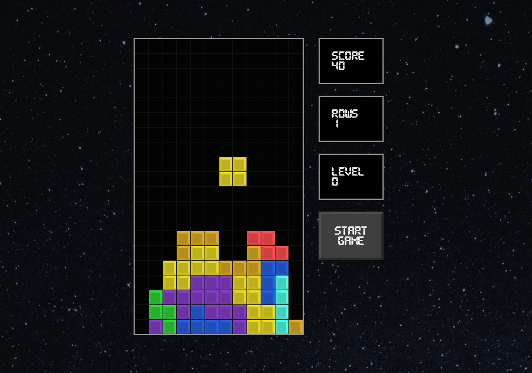

# Tetris Clone

This is a Tetris Clone made by following the **[How to Build Tetris in React - GameDev Tutorial (with React Hooks!)](https://www.youtube.com/watch?v=ZGOaCxX8HIU&ab_channel=freeCodeCamp.org)**, with some UI improvements.
## Table of contents

- [Overview](#overview)
    - [The challenge](#the-challenge)
    - [Screenshot](#screenshot)
    - [Links](#links)
- [My process](#my-process)
    - [Built with](#built-with)

### The challenge

Users should be able to:

- Move and rotate the tetris piece
- The game should increase in difficult as the player levels up
- Maintain the state of the score after clearing a row

### Screenshot

### Links

- Live Site URL: [mika-marcondes.github.io/react-tetris](https://mika-marcondes.github.io/react-tetris/)

## My process

### Built with

- Flexbox
- CSS Grid
- [React](https://reactjs.org/) - JS library
- [Styled Components](https://styled-components.com/) - For styles
